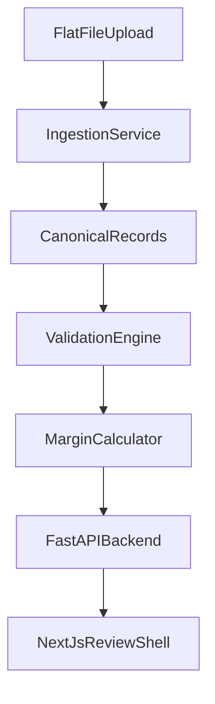

# DumpingDesk MVP Implementation Plan

## Goal

Create a runnable MVP vertical slice that proves the highest-risk workflow: ingest respondent flat files, normalize records into a canonical model, surface validation issues, calculate an initial market-economy AD margin, and present attorney-reviewable results in a web shell.

## Scope

The first repo intentionally builds less than the full architecture document. It targets one firm, one matter, flat-file ingestion only, and market-economy AD calculations. Multi-tenancy, live ERP connectors, CVD, NME factors-of-production, RAG drafting, SAS verification, ACCESS automation, and DMS integrations remain future phases.

## Architecture

## Phase 1: Repository Foundation

- Create a monorepo with `apps/web`, `services/api`, `docs`, and `.github`.
- Add root documentation, ignore rules, local environment examples, Docker Compose placeholders, and CI.
- Keep the implementation easy to run locally before adding cloud infrastructure.

## Phase 2: Backend Vertical Slice

- Model `ProceedingConfig`, `USSale`, `HomeMarketSale`, `CostOfProduction`, `ValidationEvent`, and calculation result DTOs.
- Implement CSV/XLSX ingestion with explicit field mapping.
- Normalize dates, decimals, quantities, currencies, and CONNUM values.
- Validate:
  - Required fields
  - Sale dates within POR
  - Non-positive costs
  - U.S. sales missing cost coverage
  - Price outliers by CONNUM
- Calculate:
  - Weighted-average home-market normal value by CONNUM
  - Net U.S. price from gross price minus basic adjustments
  - Per-transaction margin using `decimal.Decimal`
  - Weighted-average margin by U.S. sales value
- Expose FastAPI endpoints for health, matter summary, ingestion preview, validation, and calculation.

## Phase 3: Frontend Review Shell

- Use Next.js App Router with a server-rendered dashboard.
- Show matter configuration, pipeline status, validation events, calculation summary, and draft section placeholders.
- Keep UI components local and accessible; defer shadcn CLI installation until dependencies are installed in a real implementation sprint.

## Phase 4: Verification

- Backend: `pytest` covers ingestion, validation, and calculation behavior.
- Frontend: TypeScript build and lint scripts are wired.
- CI runs Python tests and web checks on pull requests.

## Future Phases

- Add database persistence and row-level matter scoping.
- Add Section C/D DOCX generation.
- Add attorney notes and approval workflow.
- Add RAG/document vault once the core data path is stable.
- Add multi-tenancy, APO controls, and audit logging before customer pilots.
